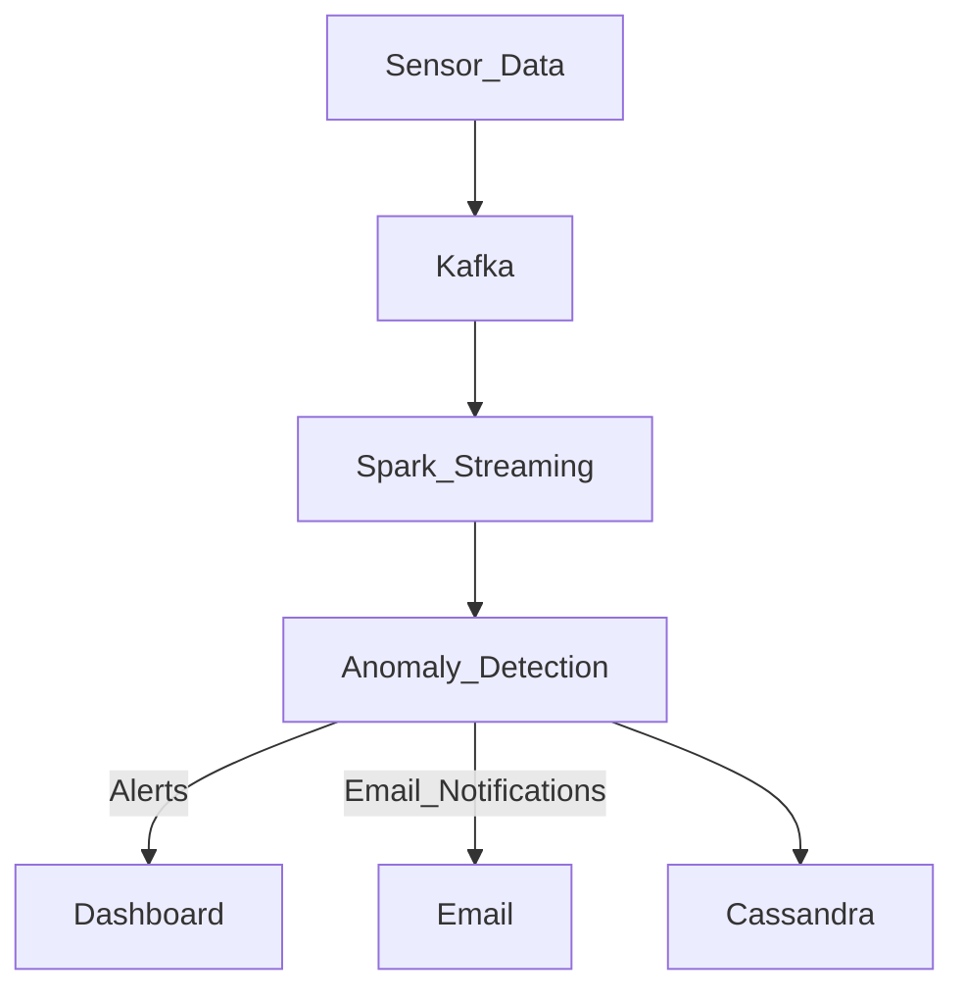

# 🏥 Real-Time Patient Monitoring System using Apache Spark & Kafka

[](https://spark.apache.org/)
[](https://kafka.apache.org/)
[](https://streamlit.io/)
[](LICENSE)

## 📚 Overview

This project presents a **Real-Time Patient Monitoring System** that utilizes **Apache Kafka** for real-time data ingestion and **Apache Spark** for stream processing. It is designed to detect anomalies in patient vitals like heart rate and SpO₂ using rule-based and machine learning techniques.

> ⚠️ Immediate alerts are generated via **email** or **dashboard** when abnormal readings are detected.  
> 🗃️ Data is stored for future analysis using **Cassandra** or **HDFS**.

---

## 🧠 Features

- Real-time ingestion of patient vitals using Kafka
- Stream processing with Spark Structured Streaming
- Anomaly detection based on thresholds or ML models
- Instant email alerts and real-time dashboard using Streamlit
- Scalable data storage using Cassandra/HDFS
- Future-ready for EHR integration and mobile support

---

## 🧱 Architecture


---
## 🚀 Quick Start

### ✅ Prerequisites

Make sure the following tools and dependencies are installed:

- [Apache Kafka 3.1.0](https://kafka.apache.org/)
- [Apache Spark 3.5.0](https://spark.apache.org/)
- [Python 3.x](https://www.python.org/downloads/)
- [Streamlit](https://streamlit.io/)
- [Apache Cassandra](https://cassandra.apache.org/) or HDFS for data storage

### 📦 Installation & Setup

```bash
# Clone the repository
git clone https://github.com/yourusername/real-time-patient-monitoring.git
cd real-time-patient-monitoring

# Set up a virtual environment (optional)
python -m venv venv
source venv/bin/activate  # On Windows use `venv\Scripts\activate`

# Install required Python packages
pip install -r requirements.txt
```
---
# Define the additional markdown content based on the user's text
additional_markdown = """
## 📊 Dashboard Preview

> Real-time visualization of patient vitals (heart rate, SpO₂, etc.) and anomaly alerts.


_Above: Streamlit Dashboard showing live patient health metrics and alert triggers._

---

## 📧 Alert System

- ⚠️ **Anomaly Conditions**:
  - Heart Rate > 120 bpm
  - SpO₂ < 90%

- 📩 **Action**:
  - Instant email alert with patient ID & timestamp
  - Real-time update on the dashboard
  - Event logged to Cassandra or HDFS for storage

    

---

## 🧪 Dataset Used

This system has been validated using:

- [MIT-BIH Arrhythmia Dataset](https://physionet.org/content/mitdb/1.0.0/)
- [MIMIC III ICU Dataset](https://physionet.org/content/mimiciii/1.4/)
- [Simulated ECG Dataset - Kaggle](https://www.kaggle.com/datasets/shayanfazeli/heartbeat)

---

## 📈 Future Enhancements

- 🔍 Deep Learning models for predictive analytics
- 📱 Mobile app for patient and doctor notifications
- 🧠 Adaptive anomaly thresholds based on patient profiles
- 🔗 EHR integration (FHIR, HL7 compliance)
- 🌐 Edge computing and federated learning for privacy

---

## 📖 References

- [Apache Kafka Docs](https://kafka.apache.org/)
- [Apache Spark Structured Streaming Guide](https://spark.apache.org/docs/latest/structured-streaming-programming-guide.html)
- [PLOS ONE - Real-Time Health Monitoring Using Kafka & Spark](https://journals.plos.org/plosone/article?id=10.1371/journal.pone.0298582)
- [ResearchGate - Smart Healthcare Monitoring Models](https://www.researchgate.net/publication/380131393_Smart_Healthcare_Management_Model_for_Proactive_Patient_Monitoring_Chronicle_Abstract)

---

## 👨‍💻 Authors

Developed by:

- **Neeraj Kumar Kannoujiya** – MSE2024003  
- **Anshuman Moharana** – MDE2024006
- **Tanmesh Singh** – MSE2024016  
_M.Tech (IT), Indian Institute of Information Technology, Allahabad (2024–2026)_

### 🧑‍🏫 Supervised by:
**Prof. Sonali Agarwal**

---

## 📜 License

This project is licensed under the [MIT License](LICENSE).  
Feel free to fork, enhance, and contribute!
"""

